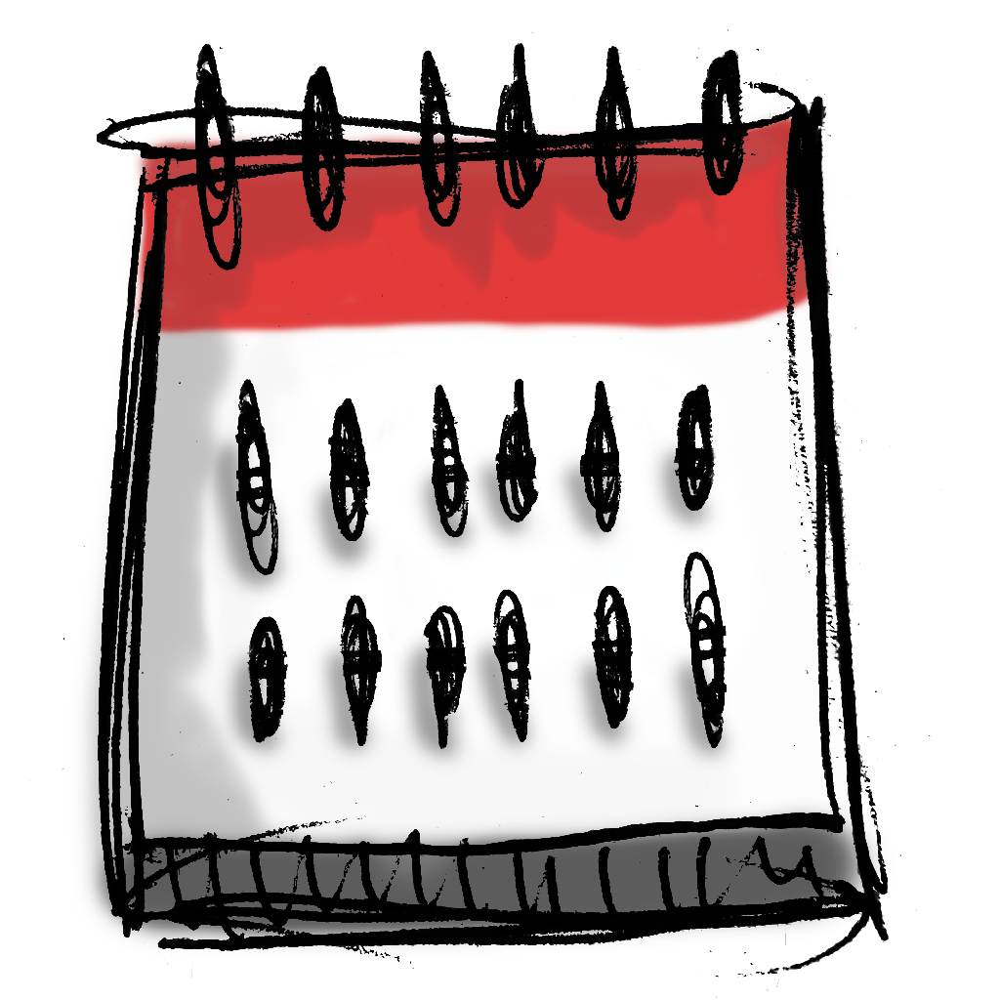

<p align="center">
  
</p>

# Discord Server Events

This is a calendar subscription file for events on a [Discord Server](https://discord.com/).

I created this because there currently isn't a way to subcribe to a calendar feed for Discord events other than to export and import them as needed.

## Subscribe to Calendar

Add the [ICS file](https://seriouslysean.github.io/discord-server-events-feed/dist/events.ics) to your calendar app.

```
https://seriouslysean.github.io/discord-server-events-feed/dist/events.ics
```

## References

- https://discord.com/developers/docs/intro
- https://en.wikipedia.org/wiki/ICalendar
